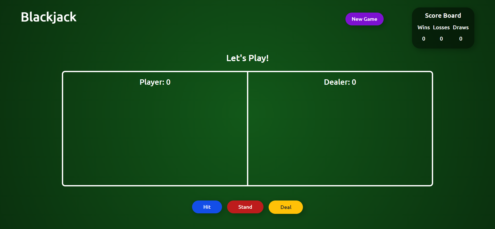

# Blackjack

Blackjack Game Website.
 
 ## Functionality
 
 Player plays with Dealer (in this case machine). Both the player and dealer play to reach a maximum total score
 of 21. If the total value of the cards played exceeds 21, it results in a bust.  
 
 Player clicks on the Hit button for a randomly picked card to be shown.  
 
 It is up to the player how many times they want to use the Hit button to show more cards until they reach bust.  
 
 After the player is done playing their cards, they have to use the Stand button for the Dealer to start playing.  
 
 The result is then automatically updated and shown on the screen.  
 
 To play again the player has to click the Deal button.  
 
 To refresh the score board, the player can either click on the New Game button or reload the page.
 
## Technologies Used

Technologies used in this project are HTML, SCSS, Bootstrap and vanilla JavaScript.

## Link

- [Live Site URL](https://afreenalam198.github.io/blackjack)

## Screenshot

